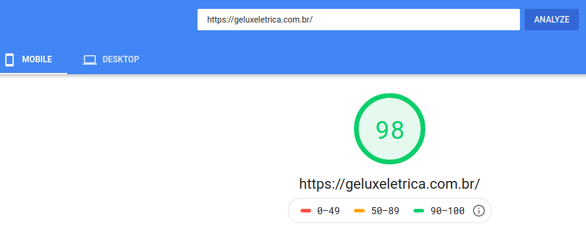

</img>

<h1 align="center">Bazar das Chaves</h1>

Projeto de criação de um<strong> Site</strong> para a empresa Bazar das Chaves.

## Descrição

O Bazar das Chaves considera importante manter um canal de contato duradouro e de fácil acesso para se comunicar com seus clientes. Foi pensando também em fortalecer a imagem da empresa e disponibilizar informações importantes para seus clientes que o BazarDasChaves quer o desenvolvimento do seu site institucional.

## Solução

Desenvolvemos um [site](https://bazardaschaves.com.br/) para o bazar das Chaves, usando o framework Gatsby.
Segue abaixo algumas informações sobre o resultado.

> Todas as informações são baseadas na tela **Mobile** e foram tiradas do site [PageSpeedInsights](https://developers.google.com/speed/pagespeed/insights/) > - By Google

- A nota da página foi de \${nota} pontos.
- O tempo que o primeiro conteúdo é desenhado na tela foi de \${nota}.
- O índice de velocidade foi de \${nota}.
- O tempo que a página leva para ficar completamente interativa foi de \${nota}.

Print

|                                           PageSpeedInsights \${Nome da empresa}                                            |
| :------------------------------------------------------------------------------------------------------------------------: |
|  |

### LINKS

Clique abaixo para fazer o teste deste site.
[PageSpeedInsights \${Nome da empresa}](`https://developers.google.com/speed/pagespeed/insights/?url=https%3A%2F%2F${SiteDaEmpresa}%2F&tab=mobile`)
